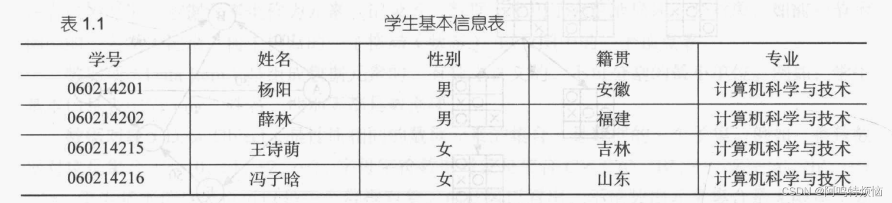
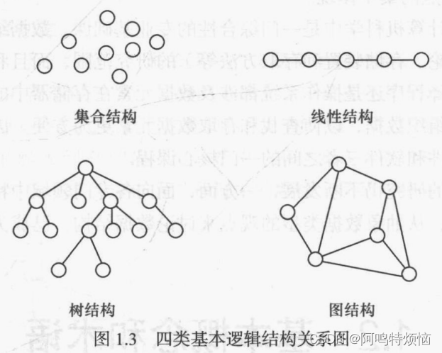
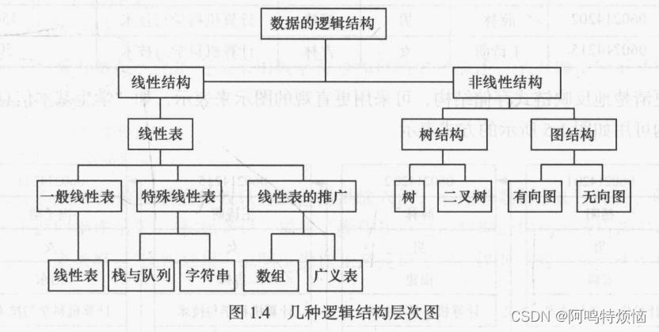
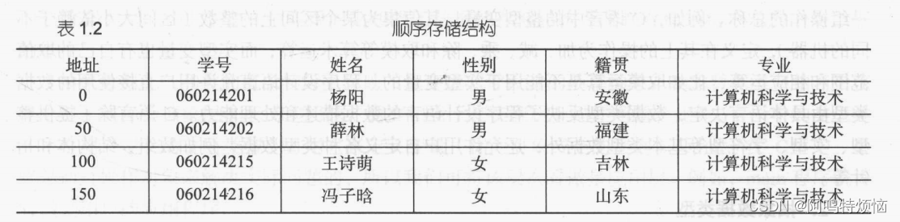

# 第一章 绪论

- 早期的计算机主要用于数值计算
- 现在计算机主要用于非数值计算，包括处理字符、表格和图像等具有一定结构的数据
	- 这些数据内容存在着某种联系，只有分清数据的内在联系，合理地组织数据，才能对他们进行有效的处理，设计出高效的算法
	- 如何合理地组织数据、高效的处理数据，这就是"数据结构"主要研究的问题
## 1.1 数据结构的研究内容

计算机主要用于数值计算时，一般要经过如下几个步骤：

 1. 首先从具体问题抽象出数学模型
 2. 然后设计一个解此数学模型的算法
 3. 最后编写程序，进行测试、调试，直到解决问题。

在此过程中寻求数学模型的实质是==分析问题==，从中提取操作的对象，并找出这些操作对象之间的关系，然后用数学语言加以描述，即建立相应的数学方程。

- 例如，用计算机进行全球天气预报时，就需要求解一组球面坐标系下的二阶椭圆偏微分方程。
- 预测人口增长情况的数学模型为常微分方程。
- 求解这些数学方程的算法是计算数学研究的范畴，如高斯消元法、差分法、有限元法等算法。
- 数据结构主要研究非数值计算问题，非数值计算问题无法用数学方程建立数学模型，下面通过三个实例加以说明。

[例1.1] 学生学籍管理系统


- 每个学生的基本信息记录按顺序号排列，形成了学生基本信息记录的线性序列，呈一种线性关系。
- 诸如此类的线性表结构还有图书馆的书目管理系统、库存管理系统等。
- 在此类问题中，计算机处理的对象是各种表，元素之间存在简单一对一的线性关系，因此这类问题的数学模型就是各种线性表，施加于对象上的操作有查找、插入和删除等。
- 这类数学模型称为“线性”的数据结构。

[例1.2]  人机对弈问题
- 计算机之所以能和人对弈是因为已经将对弈的策略在计算机中存储好。
- 由于对弈的过程是在一定规则下随机进行的，所以，为使计算机能灵活对弈，就必须把对弈过程中所有可能发生的情况及相应的对策都加以考虑。
- 以最简单的井字棋为例，初始状态是一个空的期盘格局。对弈开始后，每下一步棋，则构成一个新的棋盘格局，且相对于上一个棋盘格局的可能选择可以有多种形式，因而整个对弈过程就如同图1.1所示的“一棵倒长的树”。
<!--  -->
<center>{width=500}</center>
- 在这棵“树”中，从初始状态（根）到某一最终格局（叶子）的一条路径，就是一个具体的对弈过程。
- 人机对弈问题的数学模型就是如何用树结构表示棋盘和棋子等，算法是博弈的规则和策略。
- 诸如此类的树结构还有计算机的文件系统、一个单位的组织机构等。
- 在这类问题中，计算机处理的对象是树结构，元素之间是一对多的层次关系，施加于对象上的操作有查找、插入和删除等。
- 这类数学模型称为“树”的数据结构。

[例1.3】  最短路径问题
- 从城市A到城市B有多条线路，但每条线路的交通费不同，那么，如何选择一条线路，使得从城市A到城市B的交通费用最少呢？
- 解决的方法是，可以把这类问题抽象为图的最短路径问题。如图1.2所示，

<!--  -->
<center>{width=500}</center>
- 图中的顶点代表城市，有向边代表两个城市之间的通路，边上的权值代表两个城市之间的交通费。
- 求解A到B的最少交通费用，就是要在有向图中A点（源点）到达B点（终点）的多条路径中，寻找一条各边权值之和最小的路径，即最短路径。
- 最短路径问题的数学模型就是图结构，算法是求解两点之间的最短路径。
- 诸如此类的图结构还有网络工程图和网络通信图等，在这类问题中，元素之间是多对多的网状关系，施加于对象上的操作依然有查找、插入和删除等。
- 这类数学模型称为“图”的数据结构。


从上面三个实例可以看出，非数值计算问题的数学模型不再是数学方程，而是诸如线性表、树和图的数据结构。
因此，简单地说，数据结构是一门研究非数值计算程序设计中的操作对象，以及这些对象之间的关系和操作的学科。

- 20世纪60年代初期，“数据结构”有关的内容散见于操作系统、编译原理等课程中。
- 1968年，数据结构作为一门独立的课程被列入美国一些大学计算机科学系的教学计划，
- 数据结构的研究不仅涉及计算机硬件（特别是编码理论、存储装置和存取方法）的研究范围，而且和计算机软件的研究有着密切的关系，无论是编译程序还是操作系统都涉及数据元素在存储器中的分配问题。
- 在研究信息检索时也必须考虑如何组织数据，以使查找和存取数据元素更为方便。
- 因此，可以认为数据结构是介于数学、计算机硬件和软件三者之间的一门核心课程。

## 1.2 基本概念和术语
### 1.2.1 数据、数据元素、数据项和数据对象


- **数据**（Data）是客观事物的符号表示，是所有能输入到计算机中并被计算机程序处理的符号的总称。
	- 如数学计算中用到的整数和实数，文本编辑中用到的字符串，多媒体程序处理的图形、图像、声音及动画等通过特殊编码定义后的数据。

- **数据元素**（Data Element）是数据的基本单位，在计算机中通常作为一个整体进行考虑和处理。
	- 在有些情况下，数据元素也称为==元素==、==记录==等。
	- 数据元素用于完整地描述一个对象，如前一节示例中的一名学生记录，树中棋盘的一个格局（状态），以及图中的一个顶点等。

- **数据项**（Data Item）是组成数据元素的、有独立含义的、不可分割的最小单位。
	- 例如，学生基本信息表中的学号、姓名、性别等都是数据项。

- **数据对象**（Data Object）是性质相同的数据元素的==集合==，是数据的一个子集。
	- 例如：整数数据对象是集合N={0,±1,±2...}，
	- 字母字符数据对象是集合C={'A','B',...,'Z','a','b',...'z'}
	- 学生基本信息表也可以是一个数据对象
	- 由此可以看出，不论数据元素集合是无限集（如整数集），或是有限集（如字母字符集），还是由多个数据项组成的复合数据元素（如学生表）的集合，只要集合内元素的性质均相同，都可称之为一个数据对象。

### 1.2.2 数据结构

- **数据结构**是相互之间存在一种或多种特定关系的数据元素的集合。
- 换句话说，数据结构是带“结构”的数据元素的集合，“结构”就是指数据元素之间存在的关系。

#### 1.逻辑结构

- 数据的逻辑结构是从逻辑关系上描述数据，它与数据的存储无关，是独立于计算机的。
- 因此，数据的逻辑结构可以看作是从具体问题抽象出来的数学模型。
- 数据的逻辑结构有两个要素：
	 - 数据元素
	 - 关系
- 数据元素的含义如前所述，关系是指数据元素间的逻辑关系。
- 根据数据元素之间关系的不同特性，通常有四类基本结构，如图1.3
- 它们的复杂程序依次递进
<center></center>


下面四种结构中所举的示例是以某班级学生作为数据对象（数据元素是学生的学籍档案记录），来分别考察数据元素之间的关系。
（1）集合结构
- 数据元素之间除了“属于同一集合”的关系外，别无其他关系。
- 例如，确定一名学生是否为班级成员，只需将班级看做一个集合结构。
（2）线性结构
- 数据元素之间存在一对一的关系，
- 例如，将学生信息数据按照其入学报到的时间先后顺序进行排列，将组成一个线性结构。
（3）树结构
- 数据元素之间存在一对多的关系。
- 例如，在班级的管理体系中，班长管理多个组长，每位组长管理多名组员，从而构成树形结构。
（4）图结构或网状结构
- 数据元素之间存在多对多的关系。
- 例如，多位同学之间的朋友关系，任何两位同学都可以是朋友，从而构成图状结构或网状结构。

其中集合结构、树结构和图结构都属于非线性结构。

线性结构包括

 - 线性表（典型的线性结构，如例1.1中的学生基本信息表）
 - 栈和队列（具有特殊限制的线性表，数据操作只能在表的一端或两端进行）
 - 字符串（也是特殊的线性表，其特殊性表现在它的数据元素仅由一个字符组成）
 - 数组（是线性表的推广，它的数据元素是一个线性表）
 - 广义表（也是线性表的推广，它的数据元素是一个线性表，但不同构，即或者是单元素，或者是线性表）。

非线性结构包括

 - 树（具有多个分支的层次结构）
 - 二叉树（具有两个分支的层次结构）
 - 有向图（一种图结构，边是顶点的有序对）
 - 无向图（另一种图结构，边是顶点的无序对）

这几种逻辑结构可以用一个层次图描述，如图1.4
<center></center>

#### 2.存储结构

- 数据对象在计算机中的存储表示称为数据的==存储结构==，也称为==物理结构==。
- 把数据对象存储到计算机时，通常要求既要存储各数据元素的数据，又要存储数据元素之间的逻辑关系，数据元素在计算机内用一个结点来表示。
- 数据元素在计算机中有两种基本的存储结构，分别是顺序存储结构和链式存储结构。

（1）顺序存储结构
- 顺序存储结构是借助元素在存储器中的相对位置来表示数据元素之间的逻辑关系，通常借助程序设计语言的数组类型来描述。
- 对于前面的“学生基本信息表”，假定每个结点（学生记录）占用50个存储单元，数据从0号单元开始由低地址向高地址方向存储，对应的顺序存储结构如表1.2所示
<center></center>

（2）链式存储结构
- 链式存储结构通常借助于程序设计语言的指针类型来描述。
- 假定给前面的“学生基本信息表”中的每个结点附加一个“下一个结点地址”，即后继指针字段，用于存放后继结点的首地址，则可得到如表1.3所示的链式存储结构。
<center></center>

- 从表中可以看出，每个结点占用两个连续的存储单元，一个存放结点的信息，另一个存放后继结点的首地址。
- 为了更清楚地反映链式存储结构，可采用更直观的图示来表示，如“学生基本信息表”的链式存储结构可用如图1.5所示的方式表示。
<center></center>


（3）索引存储
- 在存储元素信息的同时，还建立附加的索引表
- 索引表中的每项称为索引项，索引项的一般形式是（关键字，地址）
- 其优点是检索速度快；缺点是附加的索引表额外占用存储空间
- 另外，增加和删除数据时也要修改索引表，因而会花费较多的时间

（4）散列存储
- 根据元素的关键字直接计算出该元素的存储地址，又称哈希Hash存储
- 其优点是检索、增加和删除节点的操作都很快
- 缺点是若散列函数不好，则可能出现元素存储单元的冲突，而解决冲突会增加时间和空间开销

#### 3. 数据的运算


- 施加在数据上的运算包括运算的定义和实现
- 运算的定义是针对逻辑结构的，指出运算的功能
- 运算的实现是针对存储结构的，指出运算的具体操作步骤

### 1.2.3 数据类型和抽象数据类型
#### 1.数据类型

- **数据类型**（Data type）是高级程序设计语言中的一个基本概念，前面提到过顺序存储结构可以借助程序设计语言的数组类型描述，链式存储结构可以借助指针类型描述，所以数据类型和数据结构的概念密切相关。

- 一方面，在程序设计语言中，每一个数据都属于某种数据类型。
- 类型明显或隐含地规定了数据的取值范围、存储方式以及允许进行的运算，数据类型是一个值的集合和定义在这个值集上的一组操作的总称。
	- 例如，C语言中的整型变量，其值集为某个区间上的整数（区间大小依赖于不同的机器），定义在其上的操作为加、减、乘、除和取模等算术运算；
	- 而实型变量也有自己的取值范围和相应运算，比如取模运算是不能用于实型变量的。
	- 程序设计语言允许用户直接使用的数据类型由具体语言决定，数据类型反映了程序设计语言的数据描述和处理能力。

#### 2.抽象数据类型

- 抽象就是抽取出实际问题的本质。在计算机中使用二进制数来表示数据，在汇编语言中则可给出各种数据的十进制表示，他们是二进制数据的抽象，使用者在编程时可以直接使用，不必考虑实现细节。
- 在高级语言中，则给出更高一级的抽象，出现了数据类型，如整型、实型、字符型等，可以进一步利用这些类型构造出线性表、栈、队列、树、图等复杂的抽象数据类型。

- **抽象数据类型**（Abstract Data Type，ADT）一般指由用户定义的、表示应用问题的数学模型，以及定义在这个模型上的一组操作的总称，具体包括三部分：
	 - 数据对象
	 - 数据对象上关系的集合
	 - 对数据对象的基本操作的集合

抽象数据类型的定义格式如下：

```c
ADT 抽象数据类型名{
  数据对象:<数据对象的定义>
  数据关系:<数据关系的定义>
  基本操作:<基本操作的定义>
}ADT 抽象数据类型名
```

其中，数据对象和数据关系的定义采用数学符号和自然语言描述，基本操作的定义格式为：

```c
基本操作名(参数表)
  初始条件:<初始条件描述>
  操作结果:<操作结果描述>
```

- 基本操作有两种参数：
	- 赋值参数只为操作提供输入值；
	- 引用参数以“&”打头，除可提供输入值外，还将返回操作结果。
- “初始条件”描述了操作执行之前数据结构和参数应满足的条件，若初始条件为空，则省略。
- “操作结果”说明了操作正常完成之后，数据结构的变化状况和返回的结果。

## 1.3 抽象数据类型的表示与实现

- 运用抽象数据类型描述数据结构，有助于在设计一个软件系统时，不必首先考虑其中包含的数据对象，以及操作在不同处理器中的表示和实现细节，而是在构成软件系统的每个相对独立的模块上定义一组数据和相应的操作，把这些数据的表示和操作细节留在模块内部解决，在更高的层次上进行软件的分析和设计，从而提高软件的整体性能和利用率。

- 抽象数据类型的概念与面向对象方法的思想是一致的。
- 抽象数据类型独立于具体实现，将数据和操作封装在一起，使得用户程序只能通过抽象数据类型定义的某些操作来访问其中的数据，从而实现了信息隐藏。
- 在C++中，我们可以用类的声明表示抽象数据类型，用类的实现来实现抽象数据类型。
- 因此，C++中实现的类相当于数据的存储结构及其在存储结构上实现的对数据的操作。

- 抽象数据类型和类的概念实际上反映了程序或软件设计的两层抽象：
	- 抽象数据类型相当于在概念层（或称为抽象层）上描述问题，
	- 而类相当于在实现层描述问题。
- 此外，C++中的类只是一个由用户定义的普通类型，可用它来定义变量（称为对象或类的实例）。
- 因此，在C++中，最终是通过操作对象来解决实际问题的，所以我们可将该层次看作是应用层。
	- 例如，main程序就可看作是用户的应用程序。

- 由此可以看出，最终表示和实现抽象数据类型，最好用面向对象的方法，
	- 比如用C++语言的类描述比较方便、有效，但本课程大都在大学低年级开设，用C语言的描述方法更符合学生的实际情况。

## 1.4算法和算法分析
### 1.4.1 算法的定义及特性

- 算法是为了解决某类问题而规定的一个有限长的操作序列。
- 一个算法必须满足以下五个重要特性
（1）有穷性
（2）确定性
（3）可行性
（4）输入
（5）输出
### 1.4.2 评价算法优劣的基本标准

- 正确性
- 可读性
- 健壮性
- 高效性
### 1.4.3 算法的时间复杂度

- 衡量算法效率的方法主要有两类：
	 - 事后统计法
		 - 事后统计法需要先将算法实现，然后测算其时间和空间开销。
		 - 这种方法的缺陷很显然，一是必须把算法转换成可执行的程序，二是时空开销的测算结果依赖于计算机的软硬件等环境因素，这容易掩盖算法本身的优劣。
	 - 事前分析估算法
		 - 所以我们通常采用事前分析估算法，通过计算算法的渐进复杂度来衡量算法的效率。


#### 1.问题规模和语句频度

- 不考虑计算机的软硬件等环境因素，影响算法时间代价的最主要因素是**问题规模**。
- **问题规模**是算法求解问题输入量的多少，是问题大小的本质表示，一般用整数n表示。
- 问题规模n对不同的问题含义不同，
	- 例如，在排序运算中n为参加排序的记录数，
	- 在矩阵运算中n为矩阵的阶数，
	- 在多项式计算中n为多项式的项数，
	- 在集合运算中n为集合中元素的个数，
	- 在树的有关运算中n为树的结点个数，
	- 在图的有关运算中n为图的顶点数或边数。
	- 显然，n越大算法的执行时间越长。
- 一个算法的执行时间大致上等于其所有语句执行时间的总和，而语句的执行时间则为该条语句的重复执行次数和执行一次所需时间的乘积。
- 一条语句的重复执行次数称作**语句频度**（Frequency Count）
- 由于语句的执行要由源程序经编译程序翻译成目标代码，目标代码经装配再执行，因此语句执行一次实际所需的具体时间是与机器的软、硬件环境（如机器速度、编译程序质量等）密切相关的。
- 所以，所谓的算法分析并非精确统计算法实际执行所需时间，而是针对算法中语句的执行次数做出估计，从中得到算法执行时间的信息。

- 设每条语句执行一次所需的时间均是单位时间，则一个算法的执行时间可用该算法中所有语句频度之和来度量。


#### 2. 算法的时间复杂度定义


#### 3. 算法的时间复杂度分析举例


#### 4. 最好、最坏和平均时间复杂度


### 1.4.4 算法的空间复杂度


## 例题
1. 可以用（抽象数据类型）来定义一个完整的数据结构
- 抽象数据类型ADT描述了数据的逻辑结构和抽象运算，通常用（数据对象，数据关系，基本操作集）这样的三元组来表示，从而可构成一个完整的数据结构定义

2. 以下属于逻辑结构的是（有序表）
- 有序表是指关键字有序的线性表，仅描述元素之间的逻辑关系，它既可以链式存储，又可以顺序存储，所以属于逻辑结构
- 顺序表、哈希表和单链表是三种不同的数据结构，既描述逻辑结构，又描述存储结构和数据运算

3. 数据的逻辑结构是从面向实际问题的角度出发的，只采用抽象表达方式，独立于存储结构，数据的存储方式有多种不同的选择
- 而数据的存储结构是逻辑结构在计算机上的映射，它不能独立于逻辑结构而存在
- 数据结构包括三个要素
	- 逻辑结构
	- 存储结构
	- 数据的运算
<center></center>


- 对于两种不同的数据结构，逻辑结构或物理结构一定不相同吗？
	- 应该注意到，数据的运算也是数据结构的一个重要方面
	- 对于两种不同的数据结构，它们的逻辑结构和物理结构完全有可能相同
	- 比如二叉树和二叉排序树，二叉排序树可以采用二叉树的逻辑表示和存储方式，前者通常用于表示层次关系，而后者通常用于排序和查找
	- 虽然它们的运算都有建立树、插入结点、删除结点和查找结点等功能，但对于二叉树和二叉排序树，这些运算的定义是不同的，以查找结点为例，二叉树的平均时间复杂度为O(n)，而二叉排序树的平均时间复杂度为O($log_2$n)


