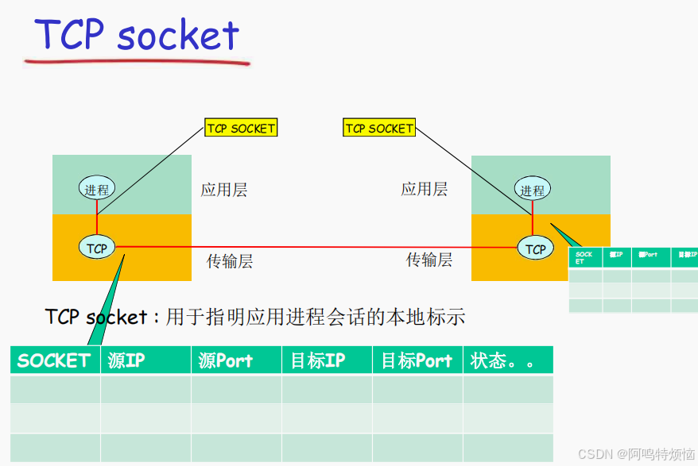
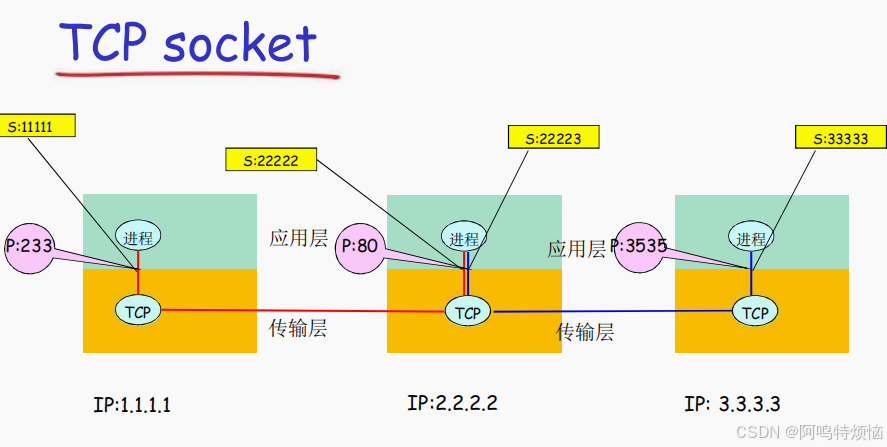
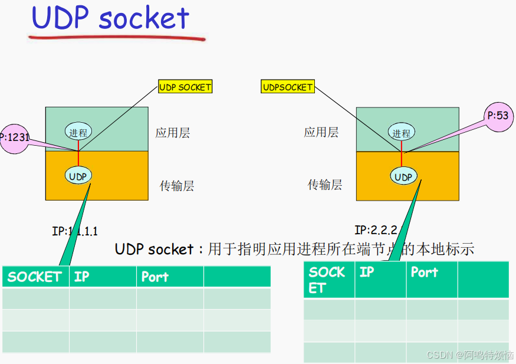
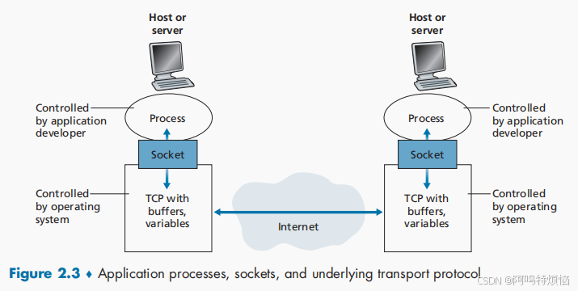
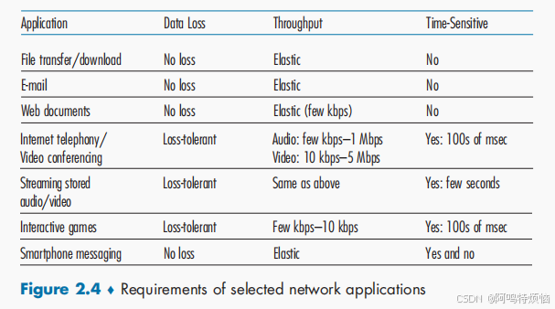
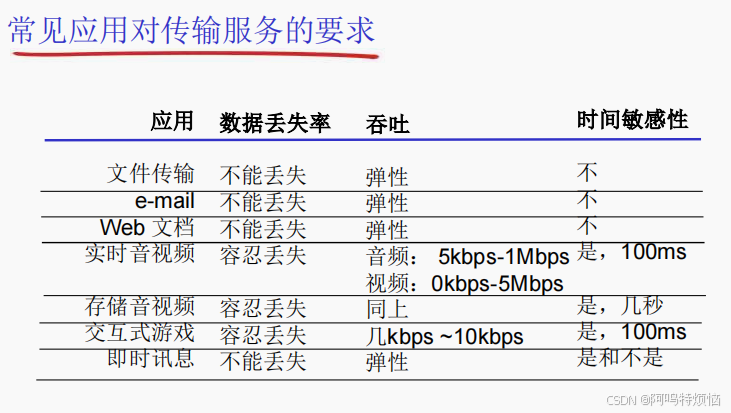
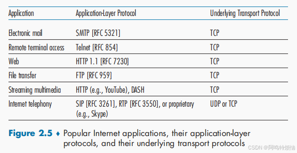
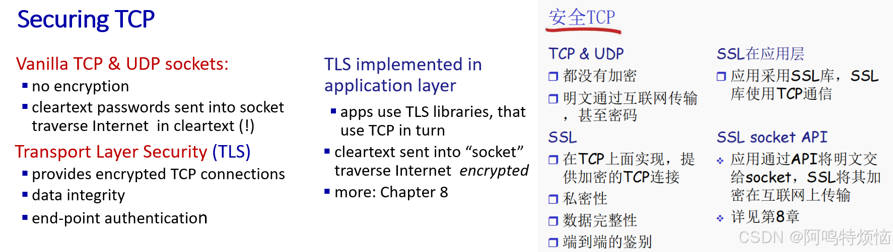

> 引用于Computer Networking: A Top-Down Approach  8th edition   n  Jim Kurose, Keith Ross Pearson, 2020
	引用于中国科学技术大学郑烇计算机网络课件
	引用于哈尔滨工业大学计算机
	引用于《计算机网络：吴功宜》

1. 网络应用有哪些特点？
2. 与单机应用有哪些本质性的不同？
3. 网络应用应采取什么样的体系结构？
4. 从互联网应用系统的工作模式角度，网络应用可以分为两类：C/S模式与P2P模式

#网络应用模型
# 2.1.1 Network Application Architectures

## 网络应用的体系结构（可能的应用架构）：
1. 客户-服务器结构(client-server architecture)
2. 对等模式(p2p architecture)peer to peer
3. 混合体：客户-服务器和对等体系结构hybrid

## C/S体系结构(Client-server paradigm)
### server（服务器）:
- always-on host一直运行
- permanent IP address固定的IP地址和周知的端口号（约定）
- often in data centers, for scaling
扩展性：服务器场，数据中心进行扩展，扩展性差

### clients（客户端）:
- contact, communicate with server主动与服务器通信
- may be intermittently connected与互联网有间歇性的连接
- may have dynamic IP addresses可能是动态IP地址
- do not communicate directly with each other不直接与其它客户端通信
- examples:Web[[2.2 The Web and HTTP]],HTTP,IMAP,FTP

## peer-peer architecture

- no always-on server（几乎）没有一直运行的服务器
- arbitrary and sysyems directly communicate任意端系统之间可以进行通信
- peers request service from other peers, provide service in return to other peers每一个节点既是客户端又是服务器
	- self scalability-new peers bring new service capacity,as well as new service demands
	- 自扩展性-新peer节点带来新的服务能力，当然也带来新的服务请求（高度可伸缩）
- peers are intermittently connected and change IP addresses参与的主机间歇性连接且可以改变IP地址
	- complex management难以管理
- example:P2P file sharing [BitTorrent[[2.5 Peer-to-Peer File Distribution]]],Gnutella,迅雷
- P2P网络是在互联网上构建的一种覆盖网（overlay network）

## C/S和P2P体系结构的混合体

### Napster
- 文件搜索：集中
	- 主机在中心服务器上注册其资源
	- 主机向中心服务器查询资源位置
- 文件传输：P2P
	- 任意peer节点之间

### 即时通信
- 在线检测：集中
	- 当用户上线时，向中心服务器注册其IP地址
	- 用户与中心服务器联系，以找到其在线好友的位置
- 两个用户之间聊天：P2P

#分布式进程通信
# 2.1.2 Processes Communicating

## processes communicating进程通信

### process:program running within a host
#### 进程：在主机上运行的应用程序
- within same host,two processes communicate using **inter-process communication** (defined by OS)在同一个主机内，使用**进程间通信机制**通信（操作系统定义）
- processes in different hosts communicate by exchanging messages不同主机，通过交换报文（Message）来通信
	- 使用OS提供的通信服务
	- 按照应用协议交换报文
		- 借助传输层提供的服务

### clients,servers
- client process:process that initiates communication
	- 客户端进程：发起通信的进程
- server process:process that waits to be contacted
	- 服务器进程：等待连接的进程

???+ note 
	applications with P2P architectures have client processes&server process

## The Interface Between the Process and the Computer Network

### 分布式进程通信需要解决的问题
- 问题1：进程标示和寻址问题（服务用户）
- 问题2：传输层-应用层提供服务是如何（服务）
	- 位置：层间界面的SAP（TCP/IP: socket）
	- 形式：应用程序接口API（TCP/IP: socket API）
- 问题3：如何使用传输层提供的服务，实现应用进程之间的报文交换，实现应用（用户使用服务）
	- 定义应用层协议：报文格式，解释，时序等
	- 编制程序，使用OS提供的API，调用网络基础设施提供通信服务传报文，实现应用时序等；

---
- 问题1：对进程进行编址（addressing）
- to receive messages,process must have identifier进程为了接收报文，必须有一个标识，即：SAP（发送也需要标识）
	- host device has unique 32-bit IP address主机：唯一的32位IP地址
		- 仅仅有IP地址不能够唯一标示一个进程；在一台端系统上有很多应用进程在运行
	- 所采用的传输层协议：TCP or UDP
	- 端口号（Port Numbers）
- example port numbers一些知名端口号的例子：
	- HTTP server: TCP 80
	- Mail server: TCP 25
	- ftp: TCP 2
- 一个进程：用IP+port标示端节点
- 本质上，一对主机进程之间的通信由2个端节点构成
- to send HTTP message to gaia.cs.umass.edu web server
	- IP address: 128.119.245.12
	- TCP
	- port number: 80
---
- 问题2：传输层提供的服务-需要穿过层间的信息
- 层间接口必须要携带的信息
	- 要传输的报文（对于本层来说，SDU）
	- 谁传的：双方的应用进程的标示：IP+TCP(UDP) 端口
	- 传给谁：对方的应用进程的标示：对方的IP+TCP(UDP)端口号
- 传输层实体（tcp或者udp实体）根据这些信息进行TCP报文段（UDP数据报）的封装
	- 源端口号，目标端口号，数据等
	- 将IP地址往下交IP实体，用于封装IP数据报：源IP，目标IP

- 问题2：传输层提供的服务-层间信息的代表
- 如果Socket API（Application Programming Interface (API)）每次传输报文，都携带如此多的信息，太繁琐易错，不便于管理
- 用个代号标示通信的双方或者单方：socket
- 就像OS打开文件返回的句柄一样
	- 对句柄的操作，就是对文件的操作
- TCP socket
	- TCP服务，两个进程之间的通信需要之前要建立连接
		- 两个进程通信会持续一段事件，通信关系稳定
	- 可以用一个整数标示两个应用实体之间的通信关系，本地标示
	- 穿过层间接口的信息最小
	- TCP socket：源IP，源端口，目标IP，目标端口

### TCP之上的套接字（socket）
- 对于使用面向连接服务（TCP）的应用而言，套接字是4元组的一个具有本地意义的标示
	- 4元组：（源IP，源port，目标IP，目标port）
	- 唯一的指定了一个会话（2个进程之间的会话关系）
	- 应用使用这个标示，与远程的应用进程通信
	- 不必在每一个报文的发送都要指定这4元组
	- 就像使用操作系统打开一个文件，OS返回一个文件句柄一样，以后使用这个文件句柄，而不是使用这个文件的目录名、文件名
	- 简单，便于管理

### UCP socket
- UDP服务，两个进程之间的通信需要之前无需建立连接
	- 每个报文都是独立传输的
	- 前后报文可能给不同的分布式进程
- 因此，只能用一个整数表示本应用实体的标示
	- 因为这个报文可能传给另外一个分布式进程
- 穿过层间接口的信息大小最小
- UDP socket：本IP，本端口
- 但是传输报文时：必须要提供对方IP，port
	- 接收报文时，传输层需要上传对方的IP，port

### UDP之上的套接字（socket）
- 对于使用无连接服务（UDP）的应用而言，套接字是2元组的一个具有本地意义的标示
	- 2元组：IP，port（源端指定）
	- UDP套接字指令流应用所在的一个端节点（end point）
	- 在发送数据报时，采用创建好的本地套接字（标示ID），就不必在发送每个报文中指明自己所采用的IP和port
	- 但是在发送报文时，必须要指定对方的ip和udp port（另外一个端节点）

### Sockets套接字
- peocess sends/receives messages to/from its socket进程向套接字发送报文或从套接字接收报文
- socket analogous to door套接字<->门户
	- sending process shoves message out door发送进程将报文推出门户
	- sending process relies on transport infrastructure on other side of door to deliver message to socket at receiving process发送进程依赖于传输层设施在另外一侧的门将报文交付给接收进程
	- two sockets involved:one on each side
- 传输基础设施向进程提供API
	- 传输协议的选择
	- 参数的设置

### 问题3：如何使用传输层提供的服务实现应用
- 定义应用层协议：报文格式，解释，时序等
- 编制程序，通过API调用网络基础设施提供通信服务传报文，解析报文，实现应用时序等

### An application-layer protocol defines:应用层协议
- 定义了，运行在不同端系统上的应用进程如何相互交换报文
	- types of messages exchanged交换的报文类型
		- e.g., request, response请求和应答报文
	- message syntax各种报文类型的语法
		- what fields in messages & how fields are delineated报文中的各个字段及其描述
	- message semantics字段的语义
		- meaning of information in fields即字段取值的含义
	- rules for when and how processes send & respond to messages进程何时、如何发送报文及对报文进行响应的规则
- 应用协议仅仅是应用的一个组成部分
	- Web应用：HTTP协议，web客户端，web服务器，HTML
- open protocols公开协议
	- defined in RFCs, everyone has access to protocol definition由RFC文档定义
	- allows for interoperability允许互操作
	- e.g., HTTP, SMTP
- proprietary protocols专用（私有）协议
	- e.g., Skype, Zoom

# 2.1.3 Transport Services Available to Applications

## what transport service does an app need?（网络应用的服务需求）
### data integrity数据丢失率reliability
- some apps(eg.,file transfer,web transactions)require 100% reliable data transfer有些应用则要求100%的可靠数据传输（如文件）
- other apps(e.g.,audio)can tolerate some loss有些应用（如音频）能容忍一定比例以下的数据丢失
### Throughput吞吐
- some apps(e.g.,multimedia)require minimum amount of throughput to be "effective"一些应用（如多媒体）必须需要最小限度的吞吐，从而使得应用能够有效运转
- other apps("elastic apps")make use of whatever throughput they get一些应用能充分利用可供使用的吞吐（弹性应用）
### Timing延迟delay
- some apps(sg.,Internet telephony,interactive games)require low delay to be "effective"一些应用处于有效性考虑，对数据传输有严格的时间限制（Internet电话、交互式游戏
### Security安全性
- encryption,data integrity
- 机密性
- 完整性
- 可认证性（鉴别）

### bandwidth

# 2.1.4 Transport Services Provided by the Internet，Internet传输层提供的服务

## TCP Services
- reliable transport between sending and receiving process
- flow control:sender won't overwhelm receiver流量控制，发送方不会淹没接收方
- congestion control:throttle sender when network overloaded拥塞控制，当网络出现拥塞时，能抑制发送方
- connection-oriented:setup required between client and server processes面向连接，要求在客户端进程和服务器端进程之间建立连接
- does not provide:timing,minimum throughput guarantee,security不能提供的服务，时间保证，最小吞吐保证和安全
## UDP Services
- unreliable data transfer between sending and receiving process
- does not provide: reliability, flow control, congestion control,timing,throughput guarantee,security,or connection setup.

???+ info "特殊情况"
	why bother?why is there a UDP?

### UDP存在的必要性
 - 能够区分不同的进程，而IP服务不能
	- 在IP提供的主机到主机端到端功能的基础上，区分了主机的应用进程
- 无需建立连接，省去了建立连接时间，适合事务性的应用
- 不做可靠性的工作，例如检错重发，适合那些对实时性要求比较高而对正确性要求不高的应用
	- 因为为了实现可靠性（准确性、保序等），必须付出时间代价（检错重发）
- 没有拥塞控制和流量控制，应用能够按照设定的速度发送数据
	- 而在TCP上面的应用，应用发送数据的速度和主机向网络发送的实际速度是不一致的，因为有流量控制和拥塞控制

## 特定网络应用及协议

.png)

